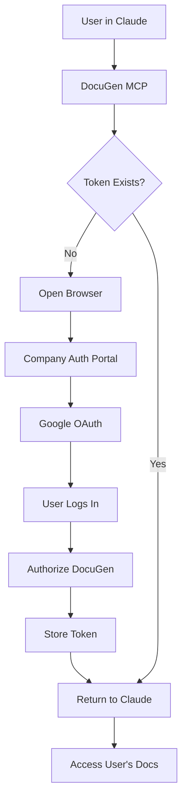

# Authentication Architecture

## The Challenge

DocuGen needs to access individual users' Google Docs, not shared company documents. This requires each user to authorize access to their personal Google account.

## Solution: Hybrid Authentication Flow

### How Enterprise Apps Handle This

Popular tools (Slack, Notion, Zapier) solve this by using a **Web-Based OAuth Flow**:



### Implementation Approaches

## 1. Web Portal Authentication (Recommended)

**Setup by IT:**
1. Deploy a web authentication portal
2. Register ONE OAuth app with Google
3. Configure redirect URI to company portal

**User Experience:**
```
1. User types: "Create a document"
2. Claude/DocuGen responds: "Please authenticate at https://auth.company.com/docugen"
3. User clicks link → logs into Google → authorizes
4. Portal shows: "Success! Return to Claude"
5. User can now create docs
```

**Code Example:**
```javascript
// auth-portal.js (deployed by IT)
const express = require('express');
const app = express();

app.get('/auth', (req, res) => {
  const authUrl = oauth2Client.generateAuthUrl({
    access_type: 'offline',
    scope: SCOPES,
    state: req.query.user_id  // Track which user is authenticating
  });
  res.redirect(authUrl);
});

app.get('/callback', async (req, res) => {
  const { code, state } = req.query;
  const { tokens } = await oauth2Client.getToken(code);
  
  // Store tokens associated with user
  await storeUserTokens(state, tokens);
  
  res.send('Authentication successful! You can close this window and return to Claude.');
});
```

**MCP Server Code:**
```javascript
// server.ts
async function getAuthForUser(userId) {
  // Check if user has tokens stored
  const tokens = await fetchUserTokens(userId);
  
  if (!tokens) {
    return {
      error: "Please authenticate at https://auth.company.com/docugen?user_id=" + userId
    };
  }
  
  oauth2Client.setCredentials(tokens);
  return oauth2Client;
}
```

## 2. Local Token Server (Alternative)

**For smaller teams, IT can deploy a local service:**

```javascript
// local-auth-service.js
class LocalAuthService {
  constructor() {
    this.tokens = new Map(); // In production, use secure storage
  }
  
  async authenticateUser(email) {
    if (!this.tokens.has(email)) {
      // Open browser for first-time auth
      const server = express();
      const port = await getAvailablePort();
      
      server.get('/callback', async (req, res) => {
        const { code } = req.query;
        const { tokens } = await oauth2Client.getToken(code);
        this.tokens.set(email, tokens);
        res.send('Authenticated! You can close this window.');
        server.close();
      });
      
      server.listen(port);
      
      const authUrl = oauth2Client.generateAuthUrl({
        redirect_uri: `http://localhost:${port}/callback`,
        scope: SCOPES
      });
      
      open(authUrl); // Opens browser
      
      // Wait for authentication
      await waitForAuth(email);
    }
    
    return this.tokens.get(email);
  }
}
```

## 3. Shared Machine Account (Limited Use)

**For specific shared documents only:**

```javascript
// Uses a shared "bot" account
const sharedAuth = new google.auth.OAuth2();
sharedAuth.setCredentials(SHARED_BOT_TOKENS);

// Can only access documents explicitly shared with bot@company.com
```

## Security Considerations

### Token Storage
```javascript
// Secure token storage
const crypto = require('crypto');

class SecureTokenStore {
  encrypt(tokens, userKey) {
    const cipher = crypto.createCipher('aes-256-gcm', userKey);
    return cipher.update(JSON.stringify(tokens), 'utf8', 'hex');
  }
  
  decrypt(encryptedTokens, userKey) {
    const decipher = crypto.createDecipher('aes-256-gcm', userKey);
    return JSON.parse(decipher.update(encryptedTokens, 'hex', 'utf8'));
  }
}
```

### Token Refresh
```javascript
async function refreshTokenIfNeeded(oauth2Client) {
  if (oauth2Client.isTokenExpiring()) {
    const { credentials } = await oauth2Client.refreshAccessToken();
    await saveUpdatedTokens(credentials);
  }
}
```

## Comparison of Approaches

| Approach | Setup Complexity | User Experience | Security | Maintenance |
|----------|-----------------|-----------------|----------|-------------|
| Individual OAuth | Hard | Complex | Good | None |
| Web Portal | Medium | Simple (one-time) | Excellent | Low |
| Local Token Server | Easy | Simple | Good | Medium |
| Service Account | Hard | Seamless | Excellent | Low |
| Shared Account | Easy | Limited | Fair | Low |

## Recommended Architecture for Your Organization

### For 200 users with Google Workspace:

1. **Deploy Authentication Portal**
   - Single OAuth app registered by IT
   - Web portal at `https://auth.yourcompany.com/docugen`
   - Users authenticate once
   - Tokens stored securely

2. **User Workflow**
   ```
   Day 1: Click link → Authorize with Google → Done
   Day 2+: Just use DocuGen, already authenticated
   ```

3. **Token Management**
   - Tokens encrypted at rest
   - Automatic refresh handling
   - Audit logging of document access
   - Revocation capability

### Sample Implementation Timeline

- **Week 1**: IT sets up OAuth app and web portal
- **Week 2**: Test with pilot users
- **Week 3**: Roll out with simple instructions:
  - "Open Claude Desktop"
  - "When prompted, click the authentication link"
  - "Log in with your Google account"
  - "Start creating documents"

## Why This Works

1. **Users authorize once**: Like logging into any web app
2. **IT manages one OAuth app**: Not 200 individual setups
3. **Tokens are user-specific**: Each person accesses only their docs
4. **Non-technical friendly**: Just click a link and log in
5. **Secure**: Tokens never exposed to end users

## Alternative: Browser Extension

For even simpler UX, create a Chrome extension:

```javascript
// Chrome extension that handles auth
chrome.identity.launchWebAuthFlow({
  url: authUrl,
  interactive: true
}, function(redirectUrl) {
  // Extract token from redirect
  // Send to MCP server
});
```

## The Key Insight

The MCP server doesn't need to embed everyone's credentials. Instead:
1. IT provides the OAuth app credentials
2. Each user authorizes once through a web flow
3. Their personal token is stored securely
4. MCP server uses their token to access their docs

This is exactly how tools like Grammarly, Notion Web Clipper, and other document integrations work - they don't need your password, just your authorization.