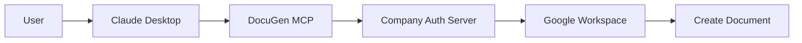

# Enterprise Deployment Guide

## Overview

This guide helps IT administrators deploy DocuGen for organizations with Google Workspace, eliminating the need for individual users to configure OAuth.

## How Multi-User Access Works

**Critical Understanding:** When you create ONE OAuth app and share it with 200+ employees, each employee still accesses ONLY their own Google Docs. Here's why:

1. **OAuth App ≠ User Access**
   - The OAuth app is just the "application identity"
   - Each user's personal login creates their own access token
   - Token determines whose documents are accessed

2. **Authentication Flow**
   ```
   Shared OAuth App (credentials.json)
           ↓
   Employee A logs in → Gets Token A → Sees only A's docs
   Employee B logs in → Gets Token B → Sees only B's docs
   Employee C logs in → Gets Token C → Sees only C's docs
   ```

3. **Security Guaranteed by Google**
   - Google validates each token against the user who authorized it
   - Impossible for Employee A to see Employee B's documents
   - Each token is stored locally on the user's machine

See [How Authentication Works](docs/HOW_AUTH_WORKS.md) for detailed explanation.

## Deployment Architecture Options

### 1. Service Account with Domain-Wide Delegation (Recommended)

**Best for:** Organizations with Google Workspace

#### Setup Steps for IT Administrators:

1. **Create Service Account**
   ```bash
   # In Google Cloud Console
   - Go to IAM & Admin > Service Accounts
   - Create new service account
   - Name: "DocuGen MCP Service"
   - Grant domain-wide delegation
   ```

2. **Configure Domain-Wide Delegation**
   - Go to Google Workspace Admin Console
   - Security > API Controls > Domain-wide delegation
   - Add service account with scopes:
     - `https://www.googleapis.com/auth/documents`
     - `https://www.googleapis.com/auth/drive`

3. **Deploy Centralized Server**
   ```javascript
   // server-config.js
   module.exports = {
     serviceAccount: './service-account-key.json',
     domain: 'yourcompany.com',
     impersonateUser: true
   };
   ```

4. **User Configuration**
   ```json
   // Distribute this config to users
   {
     "mcpServers": {
       "docugen": {
         "command": "npx",
         "args": ["@yourcompany/docugen-mcp"],
         "env": {
           "DOCUGEN_SERVER": "https://mcp.yourcompany.com"
         }
       }
     }
   }
   ```

### 2. NPM Private Package Distribution

**Best for:** Organizations with private NPM registry

#### Create NPM Package:

1. **Package Structure**
   ```
   docugen-enterprise/
   ├── package.json
   ├── index.js
   ├── config/
   │   └── oauth-config.json (embedded)
   └── scripts/
       └── setup.js
   ```

2. **package.json**
   ```json
   {
     "name": "@yourcompany/docugen-mcp",
     "version": "1.0.0",
     "private": true,
     "bin": {
       "docugen-setup": "./scripts/setup.js"
     },
     "scripts": {
       "postinstall": "node scripts/setup.js"
     }
   }
   ```

3. **Auto-Setup Script**
   ```javascript
   // scripts/setup.js
   const fs = require('fs');
   const os = require('os');
   const path = require('path');

   function setupClaude() {
     const configPath = os.platform() === 'win32' 
       ? path.join(process.env.APPDATA, 'Claude', 'claude_desktop_config.json')
       : path.join(os.homedir(), 'Library', 'Application Support', 'Claude', 'claude_desktop_config.json');
     
     const config = {
       mcpServers: {
         docugen: {
           command: "node",
           args: [path.join(__dirname, '..', 'index.js')]
         }
       }
     };
     
     fs.writeFileSync(configPath, JSON.stringify(config, null, 2));
     console.log('✅ DocuGen configured for Claude Desktop');
   }

   setupClaude();
   ```

4. **Deployment**
   ```bash
   # Publish to private registry
   npm publish --registry https://npm.yourcompany.com

   # Users install with one command
   npm install -g @yourcompany/docugen-mcp
   ```

### 3. Desktop Application Installer

**Best for:** Non-technical users

#### Windows Installer (using Electron + NSIS):

```javascript
// installer-config.js
const { MSICreator } = require('electron-wix-msi');

const msiCreator = new MSICreator({
  appDirectory: '/path/to/built/app',
  outputDirectory: '/path/to/output',
  description: 'DocuGen MCP for Claude',
  exe: 'docugen-setup',
  name: 'DocuGen MCP',
  manufacturer: 'Your Company',
  version: '1.0.0',
  ui: {
    chooseDirectory: false
  }
});

// Creates docugen-setup.msi
await msiCreator.create();
```

#### macOS Installer:

```bash
# Create .pkg installer
pkgbuild --root ./docugen \
         --scripts ./scripts \
         --identifier com.yourcompany.docugen \
         --version 1.0.0 \
         --install-location /Applications/DocuGen \
         DocuGen.pkg
```

## Enterprise Configuration Examples

### 1. Shared OAuth App Configuration

```javascript
// enterprise-oauth.js
const { google } = require('googleapis');

class EnterpriseAuth {
  constructor() {
    this.oauth2Client = new google.auth.OAuth2(
      process.env.ENTERPRISE_CLIENT_ID,
      process.env.ENTERPRISE_CLIENT_SECRET,
      'https://auth.yourcompany.com/callback'
    );
  }

  async authenticateUser(email) {
    // Use company SSO to verify user
    // Return pre-authorized tokens
    return this.getStoredTokens(email);
  }
}
```

### 2. Centralized Template Management

```javascript
// template-server.js
const express = require('express');
const app = express();

app.get('/templates', authenticate, (req, res) => {
  // Serve company-approved templates
  res.json({
    templates: [
      'company-prd',
      'company-tech-spec',
      'quarterly-report',
      'board-presentation'
    ]
  });
});
```

### 3. Usage Monitoring

```javascript
// monitoring.js
class UsageMonitor {
  logDocumentCreation(user, templateId, docId) {
    // Track usage for compliance
    this.analytics.track({
      event: 'document_created',
      user: user.email,
      template: templateId,
      timestamp: new Date()
    });
  }
}
```

## Security Considerations

### For Google Workspace Organizations:

1. **Use Service Accounts**
   - More secure than individual OAuth
   - Centralized control
   - Audit logging

2. **Restrict Scopes**
   - Only grant necessary permissions
   - Use read-only where possible

3. **Monitor Usage**
   - Track document creation
   - Set quotas per user
   - Alert on suspicious activity

### Authentication Flow:



## Deployment Checklist

### For IT Administrators:

- [ ] Create Google Cloud Project
- [ ] Enable Google Docs and Drive APIs
- [ ] Set up service account or OAuth app
- [ ] Configure domain-wide delegation (if using service account)
- [ ] Deploy MCP server or NPM package
- [ ] Create installer or setup script
- [ ] Document internal setup process
- [ ] Test with pilot users
- [ ] Roll out to organization

### For End Users (After IT Setup):

- [ ] Install Claude Desktop
- [ ] Run company-provided installer or npm package
- [ ] Restart Claude Desktop
- [ ] Start using DocuGen commands

## Support Resources

### Common Issues:

**"Not authorized" errors**
- Service account needs domain-wide delegation
- User might not be in allowed group

**Templates not loading**
- Check network connection to template server
- Verify user permissions

**Claude not recognizing DocuGen**
- Restart Claude Desktop completely
- Check config file syntax

### Monitoring Dashboard:

```javascript
// Simple usage dashboard
app.get('/dashboard', (req, res) => {
  res.json({
    totalDocuments: 1523,
    activeUsers: 178,
    popularTemplates: ['prd', 'tech-spec'],
    lastWeekUsage: {
      monday: 45,
      tuesday: 62,
      wednesday: 58,
      thursday: 71,
      friday: 52
    }
  });
});
```

## Cost Estimation

For 200 users:
- Google Workspace API: Included with Workspace license
- Server hosting: ~$50/month (can use existing infrastructure)
- Setup time: 2-4 hours for IT
- User training: 15 minutes per user

## Questions?

Contact your IT administrator or refer to internal documentation.